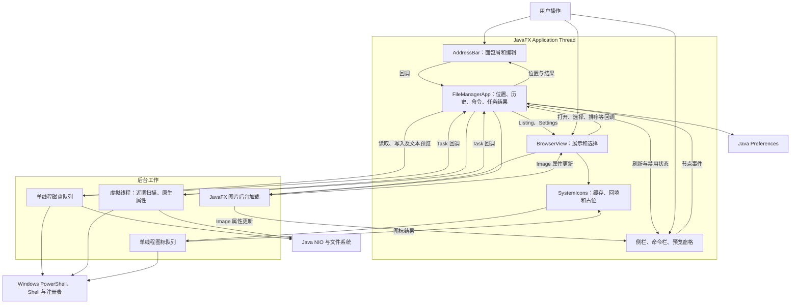
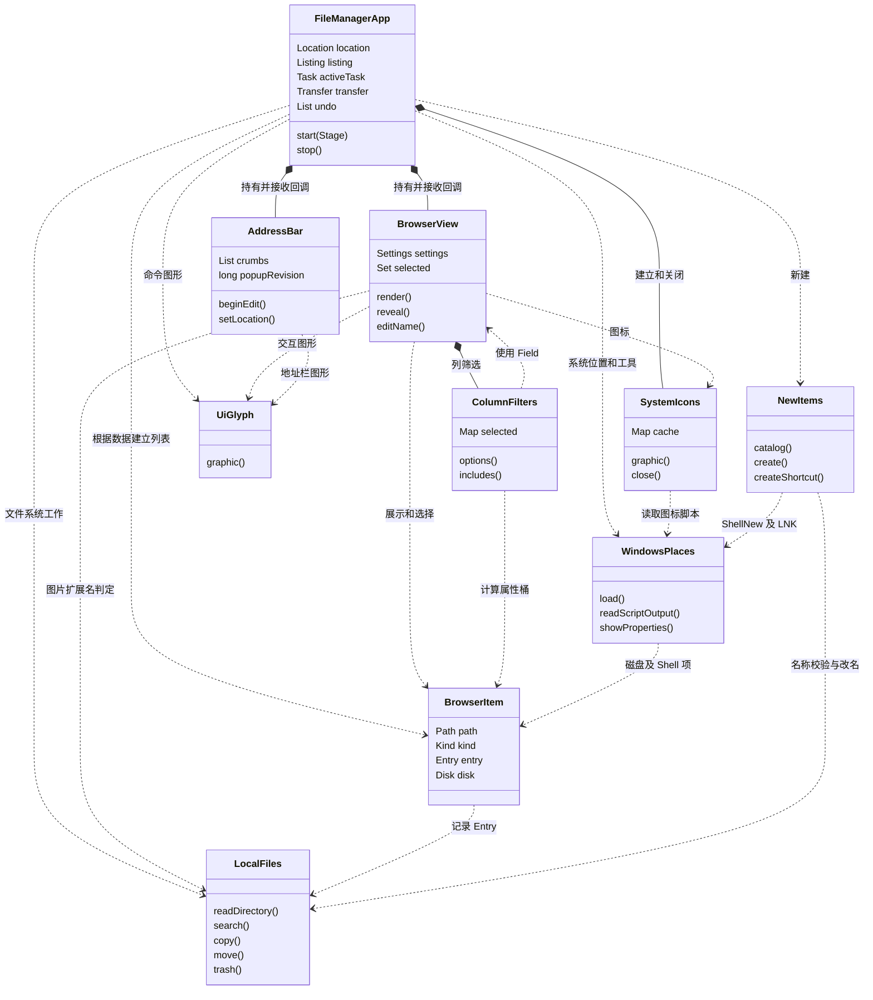
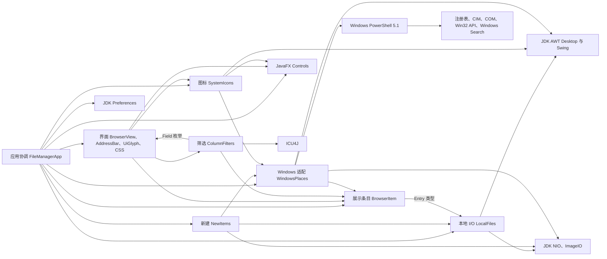

# 架构与依赖图

箭头方向为数据请求、直接调用或构造回调。平台依赖图的箭头从使用方指向被使用方。叙述和代码引用见 [03](../03_现有软件架构.md)。

## 运行时架构

```mermaid
flowchart TB
    U["用户操作"]
    subgraph F ["JavaFX Application Thread"]
      A["FileManagerApp：位置、历史、命令、任务结果"]
      AB["AddressBar：面包屑和编辑"]
      BV["BrowserView：展示和选择"]
      P["侧栏、命令栏、预览窗格"]
      IC["SystemIcons：缓存、回填和占位"]
      AB -->|回调| A
      BV -->|打开、选择、排序等回调| A
      P -->|节点事件| A
      A -->|位置与结果| AB
      A -->|Listing、Settings| BV
      A -->|刷新与禁用状态| P
      BV --> IC
    end
    subgraph T ["后台工作"]
      D["单线程磁盘队列"]
      I["单线程图标队列"]
      V["虚拟线程：近期扫描、原生属性"]
      M["JavaFX 图片后台加载"]
    end
    N["Java NIO 与文件系统"]
    W["Windows PowerShell、Shell 与注册表"]
    H["Java Preferences"]
    U --> AB
    U --> BV
    U --> P
    A -->|读取、写入及文本预览| D
    D -->|Task 回调| A
    A --> V
    V -->|Task 回调| A
    D --> N
    D --> W
    V --> W
    V --> N
    A --> H
    IC --> I
    I -->|图标结果| IC
    I --> W
    BV --> M
    A --> M
    M -->|Image 属性更新| BV
    M -->|Image 属性更新| P
```

## 核心类关系

```mermaid
classDiagram
    class FileManagerApp {
      Location location
      Listing listing
      Task activeTask
      Transfer transfer
      List undo
      start(Stage)
      stop()
    }
    class BrowserView {
      Settings settings
      Set selected
      render()
      reveal()
      editName()
    }
    class AddressBar {
      List crumbs
      long popupRevision
      beginEdit()
      setLocation()
    }
    class BrowserItem {
      Path path
      Kind kind
      Entry entry
      Disk disk
    }
    class LocalFiles {
      readDirectory()
      search()
      copy()
      move()
      trash()
    }
    class NewItems {
      catalog()
      create()
      createShortcut()
    }
    class WindowsPlaces {
      load()
      readScriptOutput()
      showProperties()
    }
    class SystemIcons {
      Map cache
      graphic()
      close()
    }
    class ColumnFilters {
      Map selected
      options()
      includes()
    }
    class UiGlyph {
      graphic()
    }
    FileManagerApp *-- BrowserView : 持有并接收回调
    FileManagerApp *-- AddressBar : 持有并接收回调
    FileManagerApp *-- SystemIcons : 建立和关闭
    FileManagerApp ..> BrowserItem : 根据数据建立列表
    FileManagerApp ..> LocalFiles : 文件系统工作
    FileManagerApp ..> NewItems : 新建
    FileManagerApp ..> WindowsPlaces : 系统位置和工具
    FileManagerApp ..> UiGlyph : 命令图形
    BrowserView *-- ColumnFilters : 列筛选
    BrowserView ..> BrowserItem : 展示和选择
    BrowserView ..> SystemIcons : 图标
    BrowserView ..> LocalFiles : 图片扩展名判定
    BrowserView ..> UiGlyph : 交互图形
    ColumnFilters ..> BrowserView : 使用 Field
    ColumnFilters ..> BrowserItem : 计算属性桶
    AddressBar ..> UiGlyph : 地址栏图形
    BrowserItem ..> LocalFiles : 记录 Entry
    WindowsPlaces ..> BrowserItem : 磁盘及 Shell 项
    SystemIcons ..> WindowsPlaces : 读取图标脚本
    NewItems ..> WindowsPlaces : ShellNew 及 LNK
    NewItems ..> LocalFiles : 名称校验与改名
```

## 模块和平台依赖

```mermaid
flowchart LR
    A["应用协调 FileManagerApp"]
    V["界面 BrowserView、AddressBar、UiGlyph、CSS"]
    M["展示条目 BrowserItem"]
    F["筛选 ColumnFilters"]
    L["本地 I/O LocalFiles"]
    C["新建 NewItems"]
    W["Windows 适配 WindowsPlaces"]
    I["图标 SystemIcons"]
    FX["JavaFX Controls"]
    J["JDK NIO、ImageIO"]
    PREF["JDK Preferences"]
    DS["JDK AWT Desktop 与 Swing"]
    ICU["ICU4J"]
    PS["Windows PowerShell 5.1"]
    SH["注册表、CIM、COM、Win32 API、Windows Search"]
    A --> V
    A --> M
    A --> L
    A --> C
    A --> W
    A --> I
    A --> PREF
    A --> FX
    V --> FX
    V --> F
    V --> I
    V --> M
    F --> M
    F -->|Field 枚举| V
    F --> ICU
    L --> J
    L --> DS
    C --> J
    C --> L
    C --> W
    M -->|Entry 类型| L
    I --> FX
    I --> DS
    I --> W
    W --> M
    W --> J
    W --> DS
    W --> PS
    PS --> SH
```
