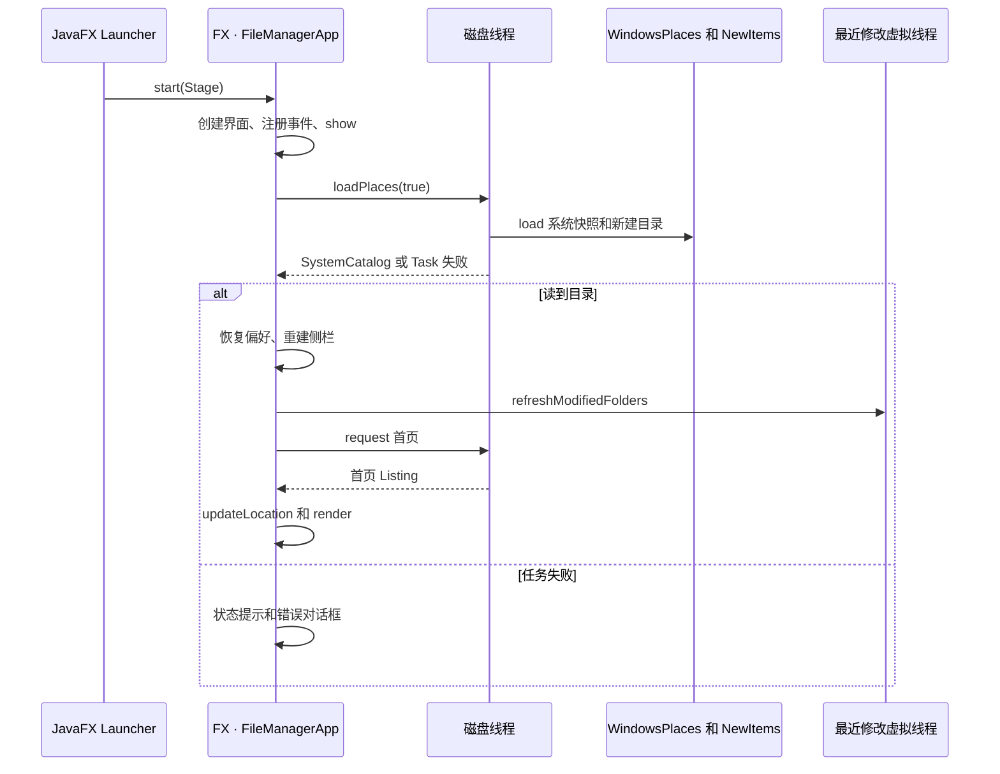
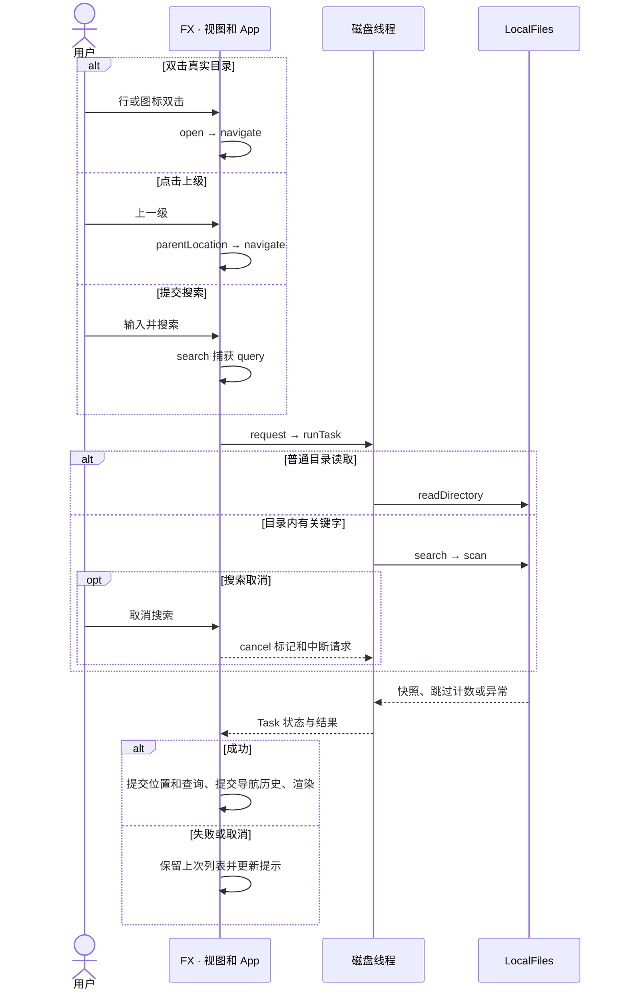
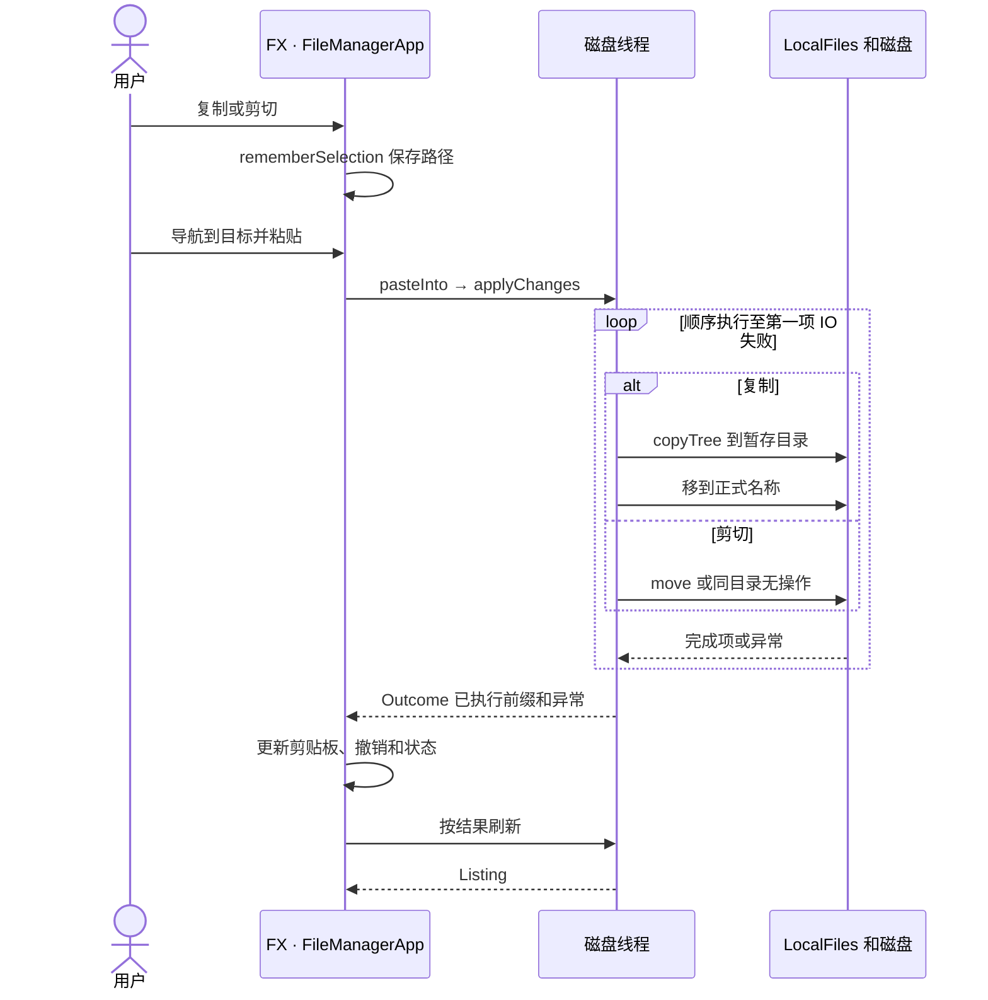
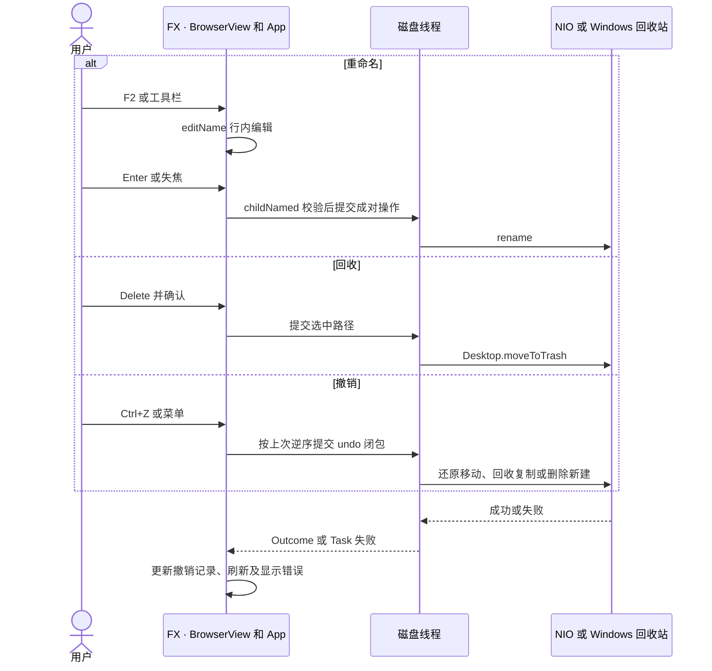
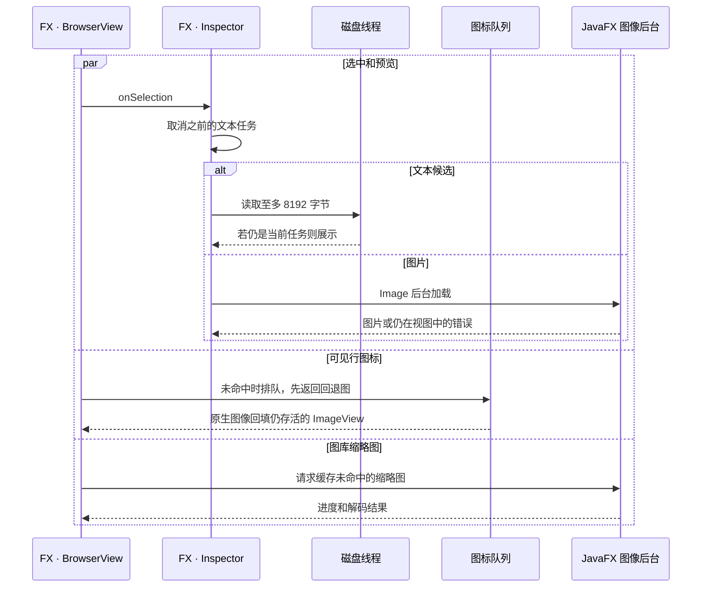

# 核心交互时序图

调用位置、限制和验证编号见 [04](../04_核心功能调用链.md)。图中的磁盘、图标和图片后台都是不同的执行路径。时序中的返回箭头表示 JavaFX 收到结果或状态事件。

## 启动

```mermaid
sequenceDiagram
    participant Launch as JavaFX Launcher
    participant FX as FX · FileManagerApp
    participant Disk as 磁盘线程
    participant Win as WindowsPlaces 和 NewItems
    participant Recent as 最近修改虚拟线程
    Launch->>FX: start(Stage)
    FX->>FX: 创建界面、注册事件、show
    FX->>Disk: loadPlaces(true)
    Disk->>Win: load 系统快照和新建目录
    Disk-->>FX: SystemCatalog 或 Task 失败
    alt 读到目录
        FX->>FX: 恢复偏好、重建侧栏
        FX->>Recent: refreshModifiedFolders
        FX->>Disk: request 首页
        Disk-->>FX: 首页 Listing
        FX->>FX: updateLocation 和 render
    else 任务失败
        FX->>FX: 状态提示和错误对话框
    end
```

## 目录、上级和搜索

```mermaid
sequenceDiagram
    actor User as 用户
    participant FX as FX · 视图和 App
    participant Disk as 磁盘线程
    participant Files as LocalFiles
    alt 双击真实目录
        User->>FX: 行或图标双击
        FX->>FX: open → navigate
    else 点击上级
        User->>FX: 上一级
        FX->>FX: parentLocation → navigate
    else 提交搜索
        User->>FX: 输入并搜索
        FX->>FX: search 捕获 query
    end
    FX->>Disk: request → runTask
    alt 普通目录读取
        Disk->>Files: readDirectory
    else 目录内有关键字
        Disk->>Files: search → scan
        opt 搜索取消
            User->>FX: 取消搜索
            FX-->>Disk: cancel 标记和中断请求
        end
    end
    Files-->>Disk: 快照、跳过计数或异常
    Disk-->>FX: Task 状态与结果
    alt 成功
        FX->>FX: 提交位置和查询、提交导航历史、渲染
    else 失败或取消
        FX->>FX: 保留上次列表并更新提示
    end
```

## 复制与剪切粘贴

```mermaid
sequenceDiagram
    actor User as 用户
    participant FX as FX · FileManagerApp
    participant Disk as 磁盘线程
    participant Data as LocalFiles 和磁盘
    User->>FX: 复制或剪切
    FX->>FX: rememberSelection 保存路径
    User->>FX: 导航到目标并粘贴
    FX->>Disk: pasteInto → applyChanges
    loop 顺序执行至第一项 IO 失败
        alt 复制
            Disk->>Data: copyTree 到暂存目录
            Disk->>Data: 移到正式名称
        else 剪切
            Disk->>Data: move 或同目录无操作
        end
        Data-->>Disk: 完成项或异常
    end
    Disk-->>FX: Outcome 已执行前缀和异常
    FX->>FX: 更新剪贴板、撤销和状态
    FX->>Disk: 按结果刷新
    Disk-->>FX: Listing
```

## 重命名、回收和撤销

```mermaid
sequenceDiagram
    actor User as 用户
    participant FX as FX · BrowserView 和 App
    participant Disk as 磁盘线程
    participant Store as NIO 或 Windows 回收站
    alt 重命名
        User->>FX: F2 或工具栏
        FX->>FX: editName 行内编辑
        User->>FX: Enter 或失焦
        FX->>Disk: childNamed 校验后提交成对操作
        Disk->>Store: rename
    else 回收
        User->>FX: Delete 并确认
        FX->>Disk: 提交选中路径
        Disk->>Store: Desktop.moveToTrash
    else 撤销
        User->>FX: Ctrl+Z 或菜单
        FX->>Disk: 按上次逆序提交 undo 闭包
        Disk->>Store: 还原移动、回收复制或删除新建
    end
    Store-->>Disk: 成功或失败
    Disk-->>FX: Outcome 或 Task 失败
    FX->>FX: 更新撤销记录、刷新及显示错误
```

## 预览与图标

```mermaid
sequenceDiagram
    participant V as FX · BrowserView
    participant A as FX · Inspector
    participant D as 磁盘线程
    participant I as 图标队列
    participant J as JavaFX 图像后台
    par 选中和预览
        V->>A: onSelection
        A->>A: 取消之前的文本任务
        alt 文本候选
            A->>D: 读取至多 8192 字节
            D-->>A: 若仍是当前任务则展示
        else 图片
            A->>J: Image 后台加载
            J-->>A: 图片或仍在视图中的错误
        end
    and 可见行图标
        V->>I: 未命中时排队，先返回回退图
        I-->>V: 原生图像回填仍存活的 ImageView
    and 图库缩略图
        V->>J: 请求缓存未命中的缩略图
        J-->>V: 进度和解码结果
    end
```
